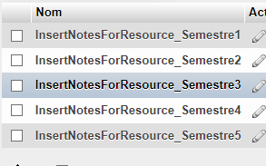

# sae3a-base

Dépôt de base de notre SAE3A.

Nom de notre BD MySQL: SAE3A_Q1E


### Les Triggers que nous avons codés :

- Dans Avis :
```
    AvisDelete
    AvisInsert
    AvisUpdate
    update_avis_counts_delete
    update_avis_counts_insert
    update_avis_counts_update
```

- Dans EtudiantImportation : 
```
    tr_Before_Instert_Etudiant (la faute de frappe est présente)
```

- Dans UtilisateurImportation :
```
    tr_before_Insert_Utilisateur
```

### Les procédures que nous avons écrites : 



### Description de notre travail en BD : 

Toutes nos fonctions SQL que nous effectuons sont dans nos Repository. Nous avons privilégié ça plutôt que d'écrire beaucoup de procédures dans la Base De Donnée, à cause du manque de temps que nous avions sur la fin par manque d'organisations. Cependant, nous avons malgré tout effectué beaucoup de requêtes différentes. Déjà, à la manière de procédures stockées, nous avons généraliser beaucoup de requêtes, que ce soit dans notre AbstractRepository ou dans les autres Repository eux même (mettreAJour, ajouter, supprimer par exemple pour AbstractRepository, triEtudiant et les autres tris (recupererEtudiantsOrdonneParNom, Prenom, Parcours) par exemple pour EtudantRepository). Nous avons aussi fait attention à ne pas utiliser de requêtes imbriquées car nous savons que ce n'est pas optimisé, et nous avons préféré les joins. Mais comme nos requêtes restaient plutôt simples, nous n'avons jamais eu besoin de faire des requêtes très compliquées. Nous avons aussi codé quelques triggers, mais pour simuler les triggers que nous n'avons pas codé, nous avons simplement fait en sorte que dans les Repository où nous faisons des update, des insert etc, nous faisions ensuite manuellement les insert ou update etc adaptés dans les tables concernées.