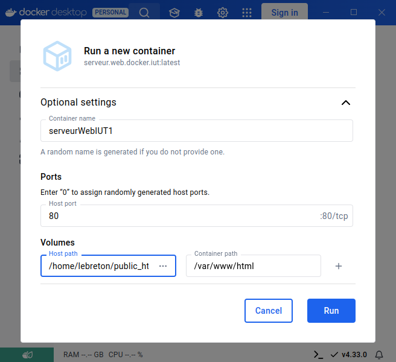

# sae3a-base

Dépôt de base de votre SAE3A.


***DEPLOIEMENT DU SITE :***

Pour déployer le site, il faut d'abord cloner notre dépôt avec cette commande : 

```bash 
git clone https://gitlabinfo.iutmontp.univ-montp2.fr/sae3a/projets/dainiuted-godekp-nguyenh-sombek/sae3a-base.git 
```

Il faudra ensuite entrer ses identifiants et son mot de passe : n'importe qui ne peut pas cloner le projet, il faut être un de ses membres.
A partir de là, il faut lancer Docker avec les bons paramètre vers le bon endroit quand on lancera notre image : 


Nom du conteneur / Container name : serveurWebIUT1
Port de la machine hôte / Host port : 80
Dans la partie Volumes,
Host path : chemin de fichier jusqu'au répertoire public_html
Container path : /var/www/html

Une fois l'image lancée, plus qu'à aller à l'adresse http://localhost/sae3a-base/web/controleurFrontal, et à partir de là on aura accès au site web... A une chose près : il va falloir versionner le fichier ConfigurationBaseDeDonnee.php avec votre identifiant et mot de passe dans 'login' et 'motDePasse' respectivement. Et **LA**, le site web sera prêt à l'utilisation.


***URL du site :***

https://webinfo.iutmontp.univ-montp2.fr/~godekp/sae3a-base/web/controleurFrontal.php


***LOGINS ET MOTS DE PASSES :***

Administrateur ;

    login : admin1
    mdp : 123

Etudiant :

    login : nom 100p
    mdp : 123

Ecole :

    login : eco3
    mdp : 123
    

Professeur :

    login : prof1
    mdp : 123


***FONCTIONNALITES PRESENTES***

- Se connecter en tant que Administrateur, Etudiant, Ecole, Professeur

- Etudiant :

     
      Accepter et refuser les demandes des écoles

- Ecole :

      Créer un compte qui sera en attente de validation par l'administrateur
      Envoyer et supprimer une demande d'accès aux infos d'un étudiant
      Enregistrer un étudiant via le code unique qui lui est partagé
      
- Professeur :

      Créer, modifier et supprimer des agrégations
      Créer, modifier et supprimer un avis sur un étudiant

- Administrateur :

        Voir la liste des utilisateurs
        Rechercher des utilisateur via leur login 
        Modifier le compte d'un utilisateur
        Voir la liste des étudiants, écoles et professeurs, et la trier selon plusieurs critères
        Rechercher un étudiant, une école ou un professeur 
        Importer des données depuis un fichier csv
        Publier et dépublier les resultats d'un semestre
        Créer, modifier et supprimer des agrégations
        Voir différents graphiques 

- Voir et modifier ses informations
- Modifier les paramètres d'accessibilités( contraste, taille de police, mode sombre)
- Se déconnecter